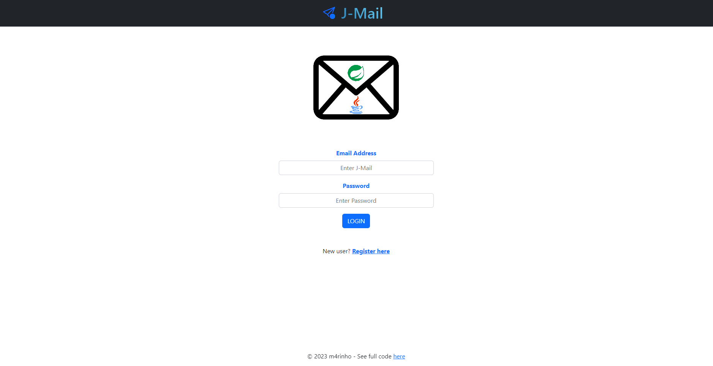
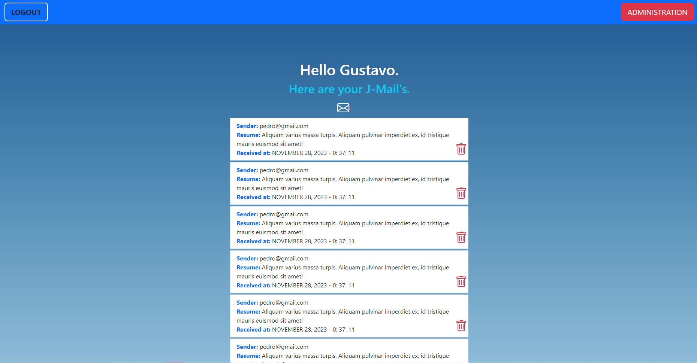

 

# ☕ J-Mail ☕

###### ⚠️ **STILL IN DEVELOPMENT** ⚠️
###### 🚫 **FULL DOCUMENTATION AVAILABLE SOON** 🚫

 

## ➖ Description ➖

### J-Mail is an E-Mail System developed using Java. 
#### Please note that the project is currently a work in progress and is incomplete.

## ➖ Technologies Used ➖

 

    

- ➡ **JDK 17:** Java Development Kit version used in this application.
- ➡ **Spring:** Comprehensive Java Framework utilized with multiple kits.
- ➡ **Spring Security:** Employed for authentication and password encryption.
- ➡ **Spring JPA:** Java Persistence API utilized in this application.
- ➡ **PostgreSQL:** Database used in this application.
- ➡ **Bootstrap:** CSS Framework used in this application.
- ➡ **Spring Thymeleaf:** Frontend Framework leveraging templates to resolve endpoints.
    - Thymeleaf is a modern server-side Java template engine that simplifies dynamic content rendering in HTML templates.
    - It uses Thymeleaf Standard Expressions (Thymeleaf dialects) for seamless integration with Spring MVC.
    - Thymeleaf allows for the creation of reusable layouts and fragments, enhancing code maintainability.

- ➡ **TESTS:** JUnit, Mockito, JAssert, H2DB.

 

##  ➖ Installation and Configuration ➖

⚠️ **STILL IN DEVELOPMENT** ⚠️

Instructions for installation and configuration will be made available upon project completion.

